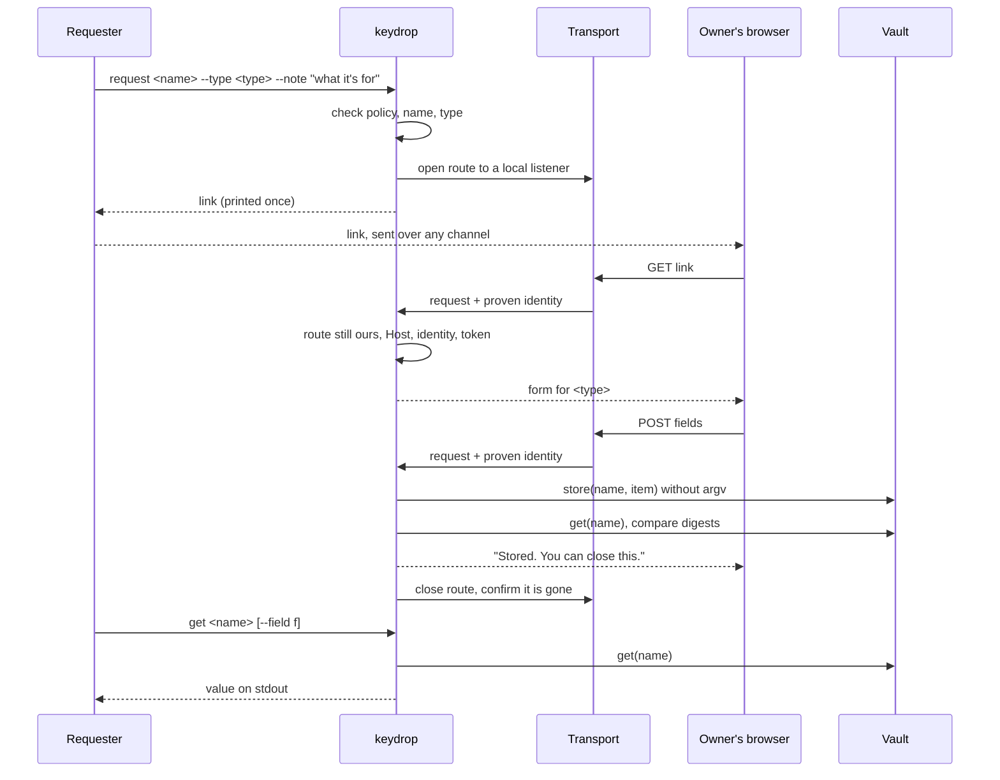

# keydrop specification

Status: draft, version 0.1.

This document describes what any keydrop must do, whatever language it is
written in and whatever machine it runs on. The Python file `keydrop` in this
repo is the reference implementation. It runs on macOS with the login
keychain as its vault and `tailscale serve` as its transport. Other
implementations can use a different vault and a different transport, as long
as they keep the flow, the page, the wording and the invariants below.

The words MUST, MUST NOT, SHOULD and MAY are used as in RFC 2119.

## Contents

1. [What keydrop is for](#1-what-keydrop-is-for)
2. [Terms](#2-terms)
3. [The flow](#3-the-flow)
4. [Invariants](#4-invariants)
5. [Item types](#5-item-types)
6. [Command interface](#6-command-interface)
7. [UX contract](#7-ux-contract)
8. [Vault adapters](#8-vault-adapters)
9. [Transport adapters](#9-transport-adapters)
10. [Conformance](#10-conformance)
11. [Extending keydrop](#11-extending-keydrop)
12. [The reference implementation against this spec](#12-the-reference-implementation-against-this-spec)
13. [Open questions](#13-open-questions)
14. [Contributing](#14-contributing)

## 1. What keydrop is for

A local tool or an agent needs a secret it doesn't have. Asking the person to
paste it into a chat, a terminal or a config file leaves a copy wherever that
text is kept. keydrop replaces the paste with a link. The requester asks for an
item by name. keydrop prints a one-shot link. The owner opens it on a device
they trust, types or pastes the value into a page, and submits. The value goes
straight into a vault on the machine, the page shuts down, and the requester
reads the value back by name.

keydrop protects the path into the vault. It does not protect the vault from
software already running as the owner on that machine.

## 2. Terms

- **Owner.** The one person allowed to submit values. Identified by a login
  the transport can prove (for example a tailnet login), or by being at the
  machine for a localhost transport.
- **Requester.** The tool or agent that asks for an item and later reads it.
  It runs on the same machine as the vault.
- **Item.** What gets stored under one name. It has a type (section 5) and one
  or more fields.
- **Page.** The web page the owner submits through. One request serves one
  page.
- **Link.** The URL of a page. It carries the page token.
- **Page token.** 256 bits of randomness in the link path. Holding it is
  necessary to reach the page. It is never sufficient on its own.
- **Vault adapter.** The part of an implementation that stores, reads, lists
  and deletes items in a particular secret store (section 8).
- **Transport adapter.** The part that makes the page reachable by the owner,
  proves who is connecting, and tears the route down again (section 9).
- **Policy.** The per-machine settings that decide which item types and
  transports are allowed at all.

## 3. The flow



In words:

1. **Request.** The requester runs `keydrop request <name>` with a type and a
   note. keydrop checks the name, checks that policy allows the type, and
   refuses before opening anything if either fails.
2. **Open.** keydrop binds a local listener, asks the transport adapter for a
   route to it, confirms the route exists, and only then starts accepting
   connections. It prints the link and detaches.
3. **Deliver the link.** The requester passes the link to the owner over
   whatever channel it already has (a chat message is fine, because the link
   is useless to anyone the transport won't authenticate as the owner).
4. **Submit.** Every request to the page is checked in this order: the route is
   still the one keydrop opened, the Host is on the allowlist, the transport's
   identity is the owner, the token matches. Only then is the form shown or a
   submission read.
5. **Store and verify.** keydrop hands the item to the vault adapter, reads it
   back, and compares. Only a match counts as stored.
6. **Close.** keydrop answers the owner with the result, closes the route,
   confirms with the transport that it is gone, and exits.
7. **Read back.** The requester runs `keydrop get <name>` and passes the value
   to whatever needs it without printing it.

A request also ends on TTL, on too many bad requests, on cancel, and on any
signal or crash. Every one of those paths closes the route.

### Optional surfaces

Two longer-lived surfaces build on the same page and the same checks. Both are
OPTIONAL. An implementation that offers them MUST meet every invariant for
them too.

- **Vault session.** A page held open for one TTL that lists names and lets
  the owner add, replace and delete items. It never shows a stored value.
- **Home page.** A vault session without a TTL, run by a service manager. It
  replaces the TTL with a persistent lockout, a write rate limit, an audit log
  and a stop switch.

## 4. Invariants

These hold in every implementation, for every item type, vault and transport.
None of them is configurable. An implementation that cannot meet one on a given
machine MUST refuse to run there and say which one.

**I1. One-shot link.** A request link accepts exactly one successful
submission. After it, the page answers nothing further and the route is
closed. A replayed link gets no form.

**I2. Bounded lifetime.** Every request link has a TTL. The default is 15
minutes and the maximum is 1 hour. When it passes, the route is closed. The
home page is the one exception and replaces the TTL with I10's lockout and
rate limit.

**I3. Only the owner can submit.** Every request, of every method, to every
path, is refused unless the transport has proven that the connecting identity
is the configured owner. If no owner is configured, nothing starts. There is
no fallback to "anyone who has the link".

**I4. The token is necessary.** The link carries at least 256 bits from a
cryptographically secure generator. Comparison is constant-time. A small fixed
number of bad requests (the reference uses 5) ends a one-shot page early.

**I5. The value never leaves the path browser → page → vault.** No field
marked secret (section 5) ever appears in:

- the argv of any process, including the vault's own CLI;
- an environment variable of a child process;
- any log, audit file or state file keydrop writes;
- an HTTP response body, header or redirect;
- shell history, a chat transcript, or the requester's output, except when
  the requester explicitly runs `get` and consumes stdout itself;
- an error message, including errors from a failed or mismatched store.

The page token is held to the same rule outside the link itself. Where a
token must persist, keydrop stores its SHA-256.

**I6. Verified store.** A store counts only once the vault returns exactly
the submitted item. The page says "Stored" only after that comparison
succeeds. A vault CLI's exit status is not evidence on its own.

**I7. The page shuts down.** On a successful store, TTL, lockout, cancel,
signal or crash, the route is closed and the listener exits. Teardown counts
only once the transport confirms the route is gone. Routes left by a killed
process are found and removed later, and only routes keydrop itself created
are ever removed.

**I8. Read-back by name only.** The requester reads items through `get <name>`
on the same machine. No page, response or log ever renders a stored value.
The vault and home pages are write-only.

**I9. The route is checked on every request.** Before anything else, each
request confirms the route still points at this listener and is not exposed
more widely than it was opened (for Tailscale, Funnel off). If it cannot
confirm that, it answers a bare 404 and the page exits.

**I10. Strikes only from the owner.** On any surface that persists a lockout,
a bad request only counts as a strike when it carries the owner's proven
identity and same-origin or absent `Sec-Fetch-Site`. A stranger or a
cross-site page cannot lock the owner out.

**I11. No public, unauthenticated exposure.** The page is never reachable
from the public internet without the transport authenticating the owner.
Section 9 lists what this rules out.

**I12. Policy is enforced before a link exists.** A request for a type or
transport that policy disables is refused at the command line. No link is
printed and no route is opened.

## 5. Item types

The requester declares the type when it asks. The page renders the fields for
that type. The vault stores the whole item under one name.

### 5.1 Field model

Every field has:

| Property | Meaning |
|---|---|
| `id` | lowercase identifier, used in the form and in `get --field` |
| `label` | exact text shown above the input |
| `kind` | `secret`, `text` or `url` |
| `required` | whether the submit is refused without it |
| `max` | maximum length in bytes after UTF-8 encoding |
| `check` | optional validation, applied server-side |

Fields of kind `secret` are covered by I5 and I8. They use a password input
with the no-save attributes in 7.3. Fields of kind `text` and `url` are also
never logged, and never rendered back, but they use visible inputs so the
owner can check what they typed.

### 5.2 `secret`

One value, such as an API key or a token. This is the default type when the
requester names none.

| id | label | kind | required | max |
|---|---|---|---|---|
| `value` | (no label; the item name is the heading) | secret | yes | 8192 |

`get <name>` prints the value.

### 5.3 `credential`

A login for a site or service.

| id | label | kind | required | max | check |
|---|---|---|---|---|---|
| `username` | Username | text | yes | 512 | |
| `password` | Password | secret | yes | 8192 | |
| `totp` | One-time code secret | secret | no | 1024 | base32, or an `otpauth://` URI |
| `url` | Website | url | no | 2048 | `https://` or `http://` scheme |
| `notes` | Notes | secret | no | 2000 | |

The requester chooses which optional fields the page shows with
`--fields totp,url,notes`. Fields it doesn't ask for are not rendered.
`notes` here are part of the item and are secret. They are separate from the
requester's `--note`, which is shown on the page and is not secret.

`get <name>` on a credential MUST require `--field <id>` and prints that one
field. It never prints all fields at once, so a careless `get` cannot dump a
password next to a username into a log.

### 5.4 Storage format

A vault adapter that has native login items (1Password, Bitwarden, KeePassXC)
SHOULD map credential fields onto them. Every other adapter stores one value
per item:

- a `secret` is stored as the raw value, so items stored by earlier versions
  and by other tools still read back;
- every other type is stored as a JSON envelope:
  `{"keydrop":1,"type":"credential","fields":{"username":"…","password":"…"}}`,
  with absent optional fields omitted.

### 5.5 Policy

Each implementation reads a policy with at least:

- `types_enabled`: the item types this machine accepts. The reference default
  is `["secret"]`. See open question Q2.
- `credential_fields_enabled`: the optional credential fields allowed. A
  machine can allow credentials but forbid TOTP seeds, for example.

A request for a disabled type or field is refused with
`keydrop: <type> requests are turned off on this machine` and exit status 2.
The vault and home pages offer only enabled types.

### 5.6 Names

Names match `^[a-z0-9._-]{1,64}$`. Every adapter MUST accept exactly this set,
and MUST validate a name before it reaches any vault command, query or path.
An adapter whose store cannot represent this set refuses to start.

## 6. Command interface

Every implementation provides these commands with these meanings. Flag names
are part of the contract so that one skill can drive any implementation.

| Command | Does |
|---|---|
| `request <name> [--type T] [--fields a,b] [--note TEXT] [--ttl D]` | opens a page and prints the link on stdout, then detaches |
| `get <name> [--field F]` | prints one value on stdout; no trailing newline when stdout isn't a terminal |
| `list` | prints names, types and times; never values |
| `status` | prints pending requests and sessions |
| `cancel <name>` | ends a pending request (`cancel vault` ends a vault session) |
| `config` | prints settings in effect, including policy and chosen adapters |
| `vault [--ttl D]` | OPTIONAL. opens a vault session |
| `home [--new-link \| --stop \| --unlock]` | OPTIONAL. the always-on page |

Exit status: 0 on success, 1 when the item doesn't exist, 2 for a refused
request (bad name, disabled type, invalid TTL, policy), 3 for a vault or
transport failure. `--ttl` accepts `<n>s`, `<n>m` or `<n>h`.

No command takes a value as an argument or from an environment variable.

## 7. UX contract

The owner should not be able to tell which implementation, vault or transport
is behind a link. Every implementation renders the same page structure, the
same copy and the same states. `reference/page.html` shows each screen.

### 7.1 Page shell

Every screen uses this document, with `{body}` replaced:

```html
<!doctype html>
<html><head><meta charset="utf-8">
<meta name="viewport" content="width=device-width,initial-scale=1">
<meta name="referrer" content="no-referrer">
<link rel="icon" href="data:,">
<title>keydrop</title>
<style>
body{font:17px -apple-system,system-ui,sans-serif;margin:0;padding:24px;max-width:480px}
h1{font-size:20px;margin:0 0 4px} h2{font-size:17px;margin:28px 0 8px} p{color:#555;margin:0 0 20px}
label{display:block;font-size:14px;color:#555;margin:0 0 4px}
input,button{font:inherit;width:100%;box-sizing:border-box;padding:14px;border-radius:10px}
input{border:1px solid #bbb;margin-bottom:12px} button{border:0;background:#111;color:#fff}
.err{color:#b00} .ok{color:#070} .meta{color:#777;font-size:14px;margin:2px 0 0}
.item{border-top:1px solid #ddd;padding:12px 0} .item b{word-break:break-all}
summary{color:#06c;margin-top:6px} details form{margin-top:10px}
button.del{background:#b00} button.quiet{background:#eee;color:#111;margin-top:28px}
.meta+form{margin-top:16px} .meta+.err{margin-top:12px}
</style></head><body>{body}</body></html>
```

The page has no script. Every response carries:

```
Content-Security-Policy: default-src 'none'; style-src 'unsafe-inline'; form-action 'self'; frame-ancestors 'none'; base-uri 'none'
Cache-Control: no-store
Referrer-Policy: no-referrer
X-Frame-Options: DENY
X-Content-Type-Options: nosniff
Content-Type: text/html; charset=utf-8
```

All dynamic text (item name, note, error) is HTML-escaped.

### 7.2 States

| ID | When | HTTP | Body |
|---|---|---|---|
| S-FORM | owner, valid token, page open | 200 | the form for the type (7.3) |
| S-STORED | submit stored and verified | 200 | `<h1>Stored. You can close this.</h1>` |
| S-EMPTY | a required field was blank | 400 | the form again, with `<p class="err">Nothing was entered.</p>`; the link is not used up |
| S-INVALID | a field failed its check | 400 | the form again, with `<p class="err">{Label} doesn't look right.</p>`; the link is not used up |
| S-BAD-FORM | body malformed, too large, or wrong fields | 400 | `<h1>That didn't look like the form.</h1>`; counts as a bad request |
| S-STORE-FAILED | vault write failed or didn't verify | 500 | `<h1>Couldn't store it. Tell whoever sent you the link.</h1>` |
| S-STALE | vault or home form token aged out | 403 | `<h1>That form is stale. Reload the page.</h1>` |
| S-EXPIRED | TTL passed, listener still up | 410 | `<h1>This link has expired. Ask for a new one.</h1>` |
| S-CANCELLED | cancelled, listener still up | 410 | `<h1>This link was cancelled. Nothing was stored.</h1>` |
| S-USED | already stored, listener still up | 410 | `<h1>This link has already been used.</h1>` |
| S-GONE | listener and route are down | none | connection refused, or the transport's own error |
| S-REFUSED | wrong identity, wrong token, wrong Host, route not ours | 404 | empty body |

How the states fit together:

- **Wrong user is S-REFUSED.** Someone the transport authenticates as anyone
  other than the owner gets a bare 404, the same as a wrong token or a wrong
  Host. Telling them "this link is for someone else" would confirm that the
  link is live, so no implementation shows a distinct wrong-user screen. See
  Q8.
- **Expired, cancelled and used need a live listener.** I7 closes the route
  as soon as the page is done, so in the common case the owner sees S-GONE.
  S-EXPIRED, S-CANCELLED and S-USED are shown only when a request arrives
  between the event and the teardown, or on a surface that stays up (vault,
  home), and only to the owner holding the right token. An implementation
  MUST NOT keep a listener up longer just to show them.
- **The form tells the owner the deadline.** S-FORM includes
  `Link ends HH:MM.` so a later S-GONE is not a surprise.
- **Bad requests.** S-REFUSED (except a wrong Host) and S-BAD-FORM count
  toward I4's limit. Browser auto-fetches of `/favicon.ico`,
  `/apple-touch-icon*.png` and `/robots.txt` get S-REFUSED and don't count.

### 7.3 Forms

All inputs for `secret` fields carry these attributes, which ask browsers and
password managers not to offer to save the value:

```
type="password" autocomplete="new-password" autocapitalize="off" autocorrect="off"
spellcheck="false" data-1p-ignore data-lpignore="true" data-bwignore data-form-type="other"
```

Inputs for `text` and `url` fields carry `autocomplete="off" autocapitalize="off"
autocorrect="off" spellcheck="false"`. Every form is
`<form method="post" action="{link path}" autocomplete="off">`.

**`secret`:**

```html
<h1>{name}</h1>
<p>{note}</p>                                  <!-- only if a note was given -->
<p class="meta">Link ends {HH:MM}.</p>
<p class="err">{error}</p>                     <!-- only on S-EMPTY / S-INVALID -->
<form method="post" action="{path}" autocomplete="off">
<input name="value" {secret attributes} autofocus required>
<button type="submit">Store</button></form>
```

**`credential`** (fields in this order; optional fields only when requested):

```html
<h1>{name}</h1>
<p>{note}</p>
<p class="meta">Link ends {HH:MM}.</p>
<form method="post" action="{path}" autocomplete="off">
<label for="username">Username</label>
<input id="username" name="username" type="text" {text attributes} autofocus required>
<label for="password">Password</label>
<input id="password" name="password" {secret attributes} required>
<label for="totp">One-time code secret (optional)</label>
<input id="totp" name="totp" {secret attributes}>
<label for="url">Website (optional)</label>
<input id="url" name="url" type="url" {text attributes}>
<label for="notes">Notes (optional)</label>
<input id="notes" name="notes" {secret attributes}>
<button type="submit">Store</button></form>
```

A new type renders the same way: heading, note, deadline, one labelled input
per field in declared order, one `Store` button.

### 7.4 Vault and home pages

These are OPTIONAL. When present, they use this copy.

| Element | Text |
|---|---|
| title (vault) | `keydrop vault` |
| title (home) | `keydrop` |
| lifetime (vault) | `Link ends HH:MM. Values are write-only here.` |
| lifetime (home) | `This page stays up until you stop it. Values are write-only here.` |
| empty list | `Nothing stored yet.` |
| item meta | `added {Mon D HH:MM} · updated {Mon D HH:MM}`, plus the type when it isn't `secret` |
| item actions | `Replace or delete` (a disclosure), `Replace`, `Delete…` |
| add heading | `Add` |
| add button | `Store` |
| flash after store | `Stored {name}.` |
| flash after delete | `Deleted {name}.` |
| confirm delete | `Delete {name}?` / `It goes from the vault for good.` / buttons `Delete {name}` and `Keep it` |
| end button (vault) | `Done, close this link` |
| end button (home) | `Stop this page` |
| after end (vault) | `Closed. The link is dead now.` |
| after stop (home) | `Stopped. It stays down until keydrop home --unlock is run on this machine.` |
| exists | `{name} already exists. Use Replace on it instead.` |
| missing | `There's no {name}.` |
| rate limited | `Too many changes in the last hour. Try again later.` |
| vault unreadable | `Couldn't read the vault.` |
| delete failed | `Couldn't delete {name}.` |
| store failed | `Couldn't store {name}.` |

Every POST on these pages carries a form token, and is refused when
`Sec-Fetch-Site` is present and not `same-origin` or `none`, or when `Origin`
is present and isn't the page's own. Writes answer with a 303 to the page.
Delete always goes through the confirm screen.

## 8. Vault adapters

### 8.1 Interface

```
capabilities() -> {native_types: [type], write_channel: "stdin" | "file-descriptor" | "api",
                   lists_without_unlock: bool, max_bytes: int}
store(name, item)  -> ok | error(reason)       # upsert
get(name)          -> item | not_found | error(reason)
list()             -> [{name, type, created?, updated?}] | error(reason)
delete(name)       -> ok | not_found | error(reason)
```

- `item` is `{type, fields}`. For adapters without native types it is
  encoded per 5.4 before it reaches the store.
- `store` is followed by `get` and a digest comparison (I6). The adapter
  doesn't decide whether a store worked; keydrop does.
- `reason` strings MUST NOT contain any field value. Build them from fixed
  text and the name.
- Every adapter works inside one namespace (a service prefix, a folder, a
  vault, a collection, an attribute) and never reads, lists or deletes
  anything outside it. `delete` validates the name and the namespace before
  calling anything.
- `list` returns names and metadata without reading values where the store
  allows it.

### 8.2 How values reach the store

This is where most adapters go wrong, so it is spelled out. A value MUST reach
the store by one of:

1. the CLI's stdin, with the value encoded so the CLI's parser can't
   misread it (the reference sends hex through `security -i`);
2. an inherited file descriptor or a pipe the CLI reads as a file;
3. a library or OS API called in-process (for example `CredWriteW` on
   Windows, the Secret Service D-Bus API on Linux);
4. a temporary file only when the file is created `0600` in a directory only
   the user can read, is written and read in one step, and is overwritten
   and removed before the page answers. This option is a last resort and the
   adapter's `capabilities()` MUST report it.

A CLI that only accepts the value as an argument (or as part of a JSON or
base64 blob in an argument) cannot be used that way. Wrap its API, pipe its
template through stdin if it supports that, or choose a different store.

The CLI's own side effects count too: if it keeps a history, writes an
undo log, or syncs a plaintext cache, the adapter's documentation says so,
and the skill tells the owner.

### 8.3 Notes on common stores

These are the things an adapter author has to check for each store. They are
starting points. Confirm each against the installed version before relying on
it, and record what was confirmed in the adapter.

| Store | Typical tool | What to check |
|---|---|---|
| macOS login keychain | `/usr/bin/security` | Reference. Write through `security -i` on stdin with `-X <hex>`. Items created by another binary prompt on every read. Exit status is the low 8 bits of an OSStatus. |
| GNOME Keyring, KWallet (Secret Service) | `secret-tool` or D-Bus | Whether `secret-tool store` reads the secret from stdin. Use an attribute such as `keydrop-name` as the namespace. Locked collections prompt on the desktop. |
| pass | `pass insert -m` | Reads from stdin. Each item becomes a GPG file and, if the store is a git repo, a commit: the value is encrypted, but names and times land in git history. |
| KeePassXC | `keepassxc-cli` | How the database password is supplied without argv. Whether `add`/`edit` read the entry password from stdin. Native fields for credentials. |
| 1Password | `op` | Whether `op item create` can take its item template on stdin. Field assignments on argv are not acceptable. Native login items. |
| Bitwarden | `bw` | `bw create item` with the encoded item on stdin instead of as an argument. How the session key reaches `bw` (`BW_SESSION` holds the session key and never the value). Native login items. |
| Windows Credential Manager | `CredWriteW` / `CredReadW` | `cmdkey /pass:` puts the value on argv, so use the API. Generic credentials have native username and password fields. |
| HashiCorp Vault, cloud secret managers | API | Request bodies go over TLS to the API, so check the client library doesn't log request bodies at debug level. |
| An env file | plain file | Stores values in plaintext on disk. See Q5 before allowing it. |

## 9. Transport adapters

### 9.1 Interface

```
open(port)              -> url | error(reason)     # route exists before this returns
identity(request)       -> login | none            # only from what the transport proves
still_ours(port)        -> yes | no | unknown      # unknown counts as no
close(port)             -> confirmed | error(reason)
host_allowlist(port)    -> [host]
ledger                  # routes this implementation created, for sweeping
```

### 9.2 Required properties

A transport adapter MUST:

- **T1.** Make the page reachable only by clients it authenticates, or only
  from the machine itself.
- **T2.** Provide an identity the client cannot forge. Where identity arrives
  as a header, the transport strips any copy the client sends, and keydrop
  refuses a request carrying more than one, or carrying any other header
  that normalises (lowercase, letters only) to the same name.
- **T3.** Use TLS for any hop that leaves the machine.
- **T4.** Let keydrop confirm on every request that the route is still its
  own and no wider than opened (I9).
- **T5.** Let keydrop confirm that a route is gone after `close`.
- **T6.** Bind the local listener to loopback only, and start accepting
  connections only after the route exists, so there is no window where the
  listener is reachable without the transport's checks in front of it.
- **T7.** Not depend on the page token for identity. The token is a second
  factor on top of T1 and T2.

### 9.3 Acceptable transports

- **Tailnet identity header (reference).** `tailscale serve` with HTTPS on a
  port, proxying to `127.0.0.1:<same port>`, identity from
  `Tailscale-User-Login`. Funnel off, checked on every request. Using the same
  port number on both sides matters under userspace networking, where
  tailscaled forwards unclaimed tailnet ports to loopback.
- **Other authenticated reverse proxies.** A proxy that authenticates the
  user and injects a verified identity (for example an identity-aware proxy
  whose signed assertion keydrop verifies itself, or a proxy reachable only
  over a private network that strips and sets the header). keydrop MUST
  verify a signed assertion where one is offered, and treat a bare header
  from a proxy reachable by anyone as unproven.
- **SSH port forward.** The owner runs `ssh -L` to the machine and opens the
  link on their own `localhost`. Identity is the SSH login, proven by SSH.
  keydrop treats the forward as the localhost transport below.
- **Localhost only.** The page listens on loopback and the owner opens it in
  a browser on the same machine. Identity is "a person at this machine". This
  is only acceptable where nothing forwards external traffic to loopback (see
  the netstack note above), and only when the owner has chosen it in policy.
  See Q1.

### 9.4 Not acceptable

- A public URL with no authentication in front of it, including Tailscale
  Funnel, an unauthenticated ngrok or cloudflared quick tunnel, or a port
  opened on a router.
- A listener on `0.0.0.0` or a LAN address, with or without a token.
- Plain HTTP across any network.
- Any identity the client can set, such as a header passed through by a proxy
  that doesn't strip it, a query parameter or a cookie keydrop issued.
- "The token is the authentication." A link pasted into a chat must be
  useless to everyone except the owner.
- A third-party paste or form service that holds the value, even briefly.

## 10. Conformance

An implementation conforms when it passes every check below on the machine
where it runs, with its chosen vault and transport. The checks are written
black-box, against the command interface (section 6) and HTTP, so they apply
to any language. Most need a fake vault and a stub transport, so that a test
never touches a real store or a real network.

The reference implementation's suites (`tests/keydrop-test` and
`tests/keydrop-home-test`) cover most of these checks today, but they are
white-box Python: they import `keydrop` and call its functions. Turning them
into a reusable suite means running them against a command and a port
instead. Until then, they are the worked example for each check, listed in the
last column.

### 10.1 Test doubles

- **Fake vault.** A store the adapter can be pointed at that records every
  call and its argv, keeps items in a file the test can read, and can be told
  to lie (report success without storing, store a different value).
- **Stub transport.** A stand-in for the transport CLI or API that records
  every call, keeps route state in a file, can be told to stall, fail, drop a
  route, or widen it (Funnel on), and lets the test send requests with the
  identity the real transport would attach.
- **Process watcher.** Something that polls the process table with full
  argv (and environment, where the OS shows it) during a real store.

### 10.2 Checks

| ID | Check | Invariant | Reference test |
|---|---|---|---|
| C-01 | A submitted value never appears in any child's argv (intercept calls) | I5 | `test_store_argv_intercepted` |
| C-02 | A process watcher running during a real store sees the vault process and never the value | I5 | `test_watch_can_see`, `test_local_flow` |
| C-03 | After a full run, neither value nor token appears in any log, state file or stub log | I5 | `test_local_flow`, `test_nothing_leaked` |
| C-04 | No response body, header or redirect contains a stored value | I5, I8 | `test_nothing_leaked`, `test_vault_local` |
| C-05 | A vault that reports success but stores nothing, or stores something else, produces S-STORE-FAILED and no "Stored" | I6 | `test_store_verified` |
| C-06 | Missing, wrong, empty, suffixed, doubled and lookalike identity headers all get S-REFUSED and store nothing | I3, T2 | `test_login_units`, `test_pin_on_request`, `test_header_spoofs` |
| C-07 | Nothing starts without a configured owner | I3 | `test_pin_on_request` |
| C-08 | Wrong tokens get S-REFUSED; the limit of bad requests ends the page and closes the route | I4, I7 | `test_units`, `test_lockout` |
| C-09 | A second submit after S-STORED gets no form | I1 | `test_local_flow` |
| C-10 | The route is closed and confirmed gone after submit, TTL, lockout, cancel and SIGKILL (by reap) | I2, I7 | `test_local_flow`, `test_expiry`, `test_lockout`, `test_cancel`, `test_sigkill_reaped_local` |
| C-11 | A teardown the transport doesn't confirm is retried and not reported done | I7 | `test_teardown_failure` |
| C-12 | The orphan sweep removes only ledgered routes that still point where keydrop pointed them | I7 | `test_orphan_shape`, `test_orphan_sweep`, `test_sweep_spares_other_state_dirs` |
| C-13 | A route removed, repointed, unreadable or widened mid-session gets S-REFUSED and the page exits | I9 | `test_route_check_pages`, `test_route_check_home`, `test_watchdog` |
| C-14 | Hosts outside the allowlist get S-REFUSED and don't count as strikes | T2, I10 | `test_host_units`, `test_rebinding`, `test_request_host` |
| C-15 | The listener isn't reachable before the route exists, and the local and routed port match where the transport needs it | T6 | `test_same_port`, `test_same_port_units` |
| C-16 | The transport is never asked to expose the page publicly (no Funnel or equivalent in any call) | I11 | `test_nothing_leaked` ("never funnel"), `test_serve_routes` |
| C-17 | There is no mode that skips the transport's identity check | I3, I11 | `test_no_local`, `test_no_http` |
| C-18 | Every response carries the headers in 7.1, and name, note and error are escaped | 7.1 | `test_units`, `test_vault_render_units` |
| C-19 | Every state in 7.2 renders the exact copy and status | 7 | partly, in the suites' body checks |
| C-20 | Names outside `^[a-z0-9._-]{1,64}$` are refused before reaching the vault | 5.6 | `test_units`, `test_vault_render_units` |
| C-21 | TTL parses `s`, `m`, `h`, and refuses zero, over an hour, and junk | I2 | `test_units` |
| C-22 | A disabled type or field is refused at `request` with exit 2 and no route opened | I12 | none yet |
| C-23 | A credential stores and reads back every requested field, and `get` without `--field` refuses | 5.3 | none yet |
| C-24 | Vault page: every POST needs a form token, cross-site Fetch Metadata and foreign Origin are refused, GET changes nothing, delete confirms | 7.4 | `test_vault_local`, `test_csrf`, `test_fetch_metadata` |
| C-25 | Vault and home delete reach only the namespace | 8.1 | `test_vault_render_units`, `test_writes` |
| C-26 | Home: strikes need the owner's identity and same-origin Fetch Metadata; the lockout and rate limit persist across restarts | I10 | `test_strangers_cant_lock`, `test_lockout`, `test_rate_limit`, `test_peer_flood`, `test_flood` |
| C-27 | Home: stop takes the route down and keeps it down until unlock, including mid start-up | I7 | `test_stop`, `test_stop_race`, `test_stop_guards`, `test_stop_flag_ends_loop` |

### 10.3 Manual round trip

The doubles copy today's output formats of the real tools. After installing
an implementation, and after any upgrade of the OS, the vault tool or the
transport, the owner does one real round trip with a throwaway name: request,
submit any string, confirm `get` returns it (compared in a script, never
printed), delete it. For a credential, one round trip per enabled optional
field.

### 10.4 Reporting

A conformance report lists the implementation, its vault and transport
adapters with versions, the OS, every check ID with pass, fail or not
applicable (with the reason), and the date of the last manual round trip.
Checks C-24 to C-27 are not applicable when the vault or home surface isn't
offered.

## 11. Extending keydrop

Three things can be added: an item type, a vault adapter, a transport
adapter. None of them may change an invariant. If an extension needs an
invariant to bend, it doesn't fit keydrop.

### 11.1 A new item type

A type is a name and an ordered list of fields (5.1).

Requirements:

- At least one field of kind `secret`.
- Every field declares its kind. When in doubt, a field is `secret`.
- Labels are short nouns in sentence case, with `(optional)` appended for
  optional fields. The page layout follows 7.3 without new elements.
- `get` addresses fields with `--field`, and refuses without it when the type
  has more than one field.
- Policy can turn it off, and it is off by default.
- The storage envelope in 5.4 covers it, so no adapter needs changes unless it
  maps the type natively.
- It ships with C-19, C-22 and C-23 equivalents for the new type.

Things to watch:

- Multi-line values (certificates, SSH keys) need a `<textarea>`. That is a
  new input element, so it needs the same no-save attributes and a spec
  change, in that order.
- File uploads change the body size limits and the parser, which is where
  request-handling bugs live. Treat a file type as a new transport-facing
  feature and get it reviewed as one.
- Every extra field is more for the owner to fill in on a phone. Prefer
  separate items over a type with many optional fields.

### 11.2 A new vault adapter

Requirements:

- Implements 8.1, and gets values to the store by one of the routes in 8.2.
- Accepts exactly the name set in 5.6 and confines itself to one namespace.
- Passes C-01 to C-05, C-20, C-23 and C-25 against a fake of the store, plus a
  manual round trip against the real one.
- Documents every side effect of the store's tool (history, sync, caches,
  git commits) and how the store is unlocked.

Things to watch:

- **Exit codes.** Several CLIs report success on a no-op update. That is why
  I6 reads back.
- **Prompts.** A store that pops an unlock dialog for every read is a store
  the owner will learn to click through. Say so in the adapter's notes.
- **Output formats.** CLIs change their output between versions. Parse
  defensively, fail closed, and pin the format in the fake.
- **Error messages.** Some tools echo their input on failure. Never pass a
  tool's stderr through to the page or a log without checking it can't hold
  a value.
- **Who else can read the item.** An item the vault shares with a team, or
  syncs to a cloud account, goes further than the machine. That may be
  exactly what the owner wants, but the adapter says so.

### 11.3 A new transport adapter

Requirements:

- Implements 9.1 and meets T1 to T7.
- Belongs to a class in 9.3, or makes the case for a new class in its pull
  request. Nothing in 9.4 is accepted.
- Passes C-06 to C-17 against a stub of the transport, plus a manual round
  trip.

Things to watch:

- **What the proxy forwards when it isn't looking.** The reference found that
  tailscaled under userspace networking forwards unclaimed ports to loopback.
  Every transport needs the same question asked: what reaches the listener
  when the route is missing?
- **Header handling.** Find out whether the proxy strips client copies of its
  identity header, and how it treats `_` versus `-` in header names.
- **Teardown.** A route the transport can't confirm gone is still open.
- **Hidden widening.** Anything that can make a private route public (a
  Funnel-style toggle, a share link, a "make public" setting) is checked on
  every request.

## 12. The reference implementation against this spec

The reference keeps working as it is. These are the differences between it
and the spec, for whoever brings it into line:

- **No item types.** It has one field, `value`. There is no `--type`,
  `--fields` or `get --field`, and no policy keys. Adding them means a JSON
  envelope for non-secret types (5.4) and the credential form (7.3).
- **No adapter seam.** The keychain calls (`keychain_*`) and the Tailscale
  calls (`ts()`, `serve_*`, `route_ours`) are called directly. Splitting them
  behind the interfaces in 8.1 and 9.1 would let a second adapter share the
  page and handler code.
- **States.** It has no S-EXPIRED, S-CANCELLED or S-USED screens, and no
  `Link ends HH:MM.` line on the request form. Once a page is done it is
  S-GONE, which this spec allows.
- **S-EMPTY.** It answers `Nothing was entered.` as a message page; the spec
  re-renders the form with the error so the owner can retry.
- **Copy.** The vault confirm text says "keychain" (`It goes from the keychain
  for good.`, `Couldn't read the keychain.`). The spec says "vault" so the copy
  is the same everywhere. The home stop message says "on the Mac".
- **Labels.** The request form's input has no label (the heading names the
  item). That stays as the `secret` layout.
- **Exit codes.** Its exit statuses don't follow section 6 exactly.
- **Tests.** The suites are white-box (10, intro). C-22 and C-23 don't exist.

## 13. Open questions

These are decisions for the project owner. The spec marks where each one
applies.

- **Q1. Is a weaker transport ever allowed?** Localhost-only, an SSH forward,
  or a LAN link with only the token. The reference refuses `--local`
  entirely because of the netstack forwarding problem. 9.3 currently allows
  localhost-only by policy where nothing forwards to loopback; that could
  equally be removed.
- **Q2. Are credentials on by default?** The spec makes `secret` the only
  default type. Some harnesses will want credentials on out of the box.
- **Q3. Do TOTP seeds belong in the same item as the password?** Keeping them
  together means one stolen item gives both factors. Splitting them means two
  requests.
- **Q4. How should `get` address fields?** The spec uses `--field`. An
  alternative is `name/field`, which would need `/` reserved in names.
- **Q5. Can an env file be a vault?** It keeps values in plaintext on disk.
  The invariants don't currently forbid plaintext at rest, only plaintext in
  argv, logs and responses. Either the spec adds an at-rest invariant, or it
  allows env files with explicit policy and `0600` permissions.
- **Q6. Are requester notes secret?** The reference stores them in plain JSON
  and tells users not to put secrets in them. The spec keeps that.
- **Q7. Are the vault and home pages part of the core?** The spec makes both
  OPTIONAL.
- **Q8. Should there be a wrong-user screen?** A distinct wrong-user
  screen would be clearer for a user signed in to the wrong account. The reference shows non-owners a bare 404 on purpose, and the spec
  keeps that. A middle ground is to show it only to an authenticated tailnet
  user who also holds the right token.
- **Q9. Should a long-lived surface show tombstones?** A home page that is up
  anyway could show S-USED or S-EXPIRED for recent one-shot tokens (stored as
  hashes) to the owner. That would replace most S-GONE cases with a clear
  message, at the cost of more state.
- **Q10. CLIs that only take values on argv.** If a popular vault has no
  stdin, file-descriptor or API route, the spec currently rules it out. The
  temporary-file route in 8.2 is the only fallback; it may be too weak.
- **Q11. TTL bounds.** 15 minutes default and an hour maximum come from the
  reference. Slow channels (email) may need longer.
- **Q12. How is conformance proven for other languages?** Either the
  reference suites get a black-box mode (run a command, talk HTTP to a port),
  or each implementation ports the checks and publishes a report per 10.4.
- **Q13. Names across vaults.** Some stores are case-insensitive or treat `.`
  specially. The spec fixes one name set and makes adapters refuse to start
  if they can't hold it.

## 14. Contributing

New item types, adapters, use cases and criticism of this spec are all
welcome. `CONTRIBUTING.md` has the steps and says how contributions are
reviewed.
